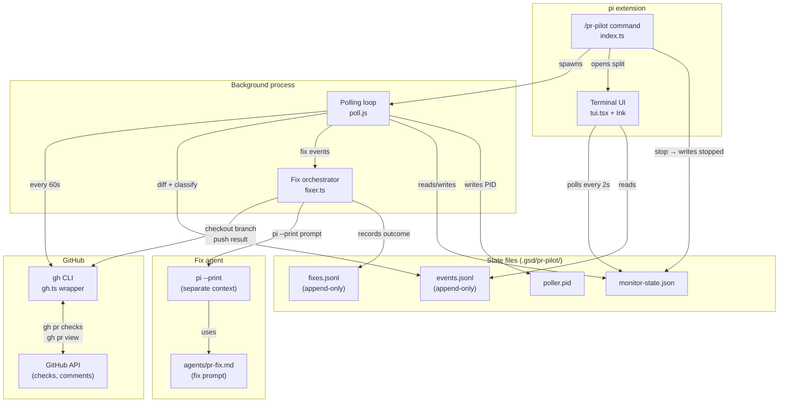

# gsd-pr-pilot

Background PR monitor for [GSD/pi](https://github.com/gsd-build/pi) — watches CI checks and review comments, auto-fixes deterministic failures, escalates the rest.

## What it does

After you create pull requests (manually or via GSD's milestone completion hook), PR Pilot monitors them in the background:

- **Polls** GitHub PRs for CI check status and new review comments
- **Auto-fixes** deterministic failures (lint errors, formatting, missing imports)
- **Escalates** issues that need judgement (architectural feedback, test failures, conflicting reviews)
- **Reports** what happened when monitoring ends
- **Live TUI** shows check status, event feed, and fix history in a terminal panel

## Prerequisites

- [GSD/pi](https://github.com/gsd-build/pi) installed
- [GitHub CLI](https://cli.github.com/) (`gh`) installed and authenticated (`gh auth login`)
- Node.js ≥ 18
- Git configured with user name and email

## Install

```bash
git clone https://github.com/gsd-build/gsd-pr-pilot.git
cd gsd-pr-pilot
npm install
npm run build
node scripts/install.js   # copies dist/ to ~/.gsd/agent/extensions/pr-pilot/
```

Restart pi to load the extension.

## Usage

```bash
# Start monitoring PRs
/pr-pilot start owner/repo#1 owner/repo#2

# Shorthand — bare PR refs also start monitoring
/pr-pilot owner/repo#1 owner/repo#2

# Check status
/pr-pilot status

# Stop monitoring and generate report
/pr-pilot stop

# Generate report without stopping
/pr-pilot report
```

## How it works



### Event flow

1. `/pr-pilot start` initialises monitor state and spawns a background polling process
2. The poller fetches `gh pr checks` and `gh pr view` every 60 seconds
3. New snapshots are diffed against the last known state (differ.ts)
4. Events are classified: **fix** (autonomous), **escalate** (needs user), or **notify** (informational)
5. Events are appended to `events.jsonl`; the TUI reads them in real time
6. For `fix` events, `fixer.ts` checks out the branch, spawns `pi --print` with the error context, then pushes the result
7. For `escalate` events, a WezTerm toast notification is shown
8. `/pr-pilot stop` writes `status: "stopped"` — the poller detects this on next cycle and exits cleanly

## Configuration

### Autonomy levels

| Level | Behaviour |
|-------|-----------|
| `fix` (default) | Fix deterministic issues autonomously, escalate the rest |
| `ask` | Ask before every change |
| `notify` | Notify only, never change anything |

### Comment source filters

| Source | Default | Description |
|--------|---------|-------------|
| `ci_checks` | enabled | CI build/test/lint failures |
| `human_reviews` | enabled | Comments from human reviewers |
| `ai_reviews` | disabled | Comments from AI review bots |
| `simplify_code` | disabled | "Simplify Code" workflow suggestions |

### Repo map

If the PR branch needs to be checked out locally, specify the local path:

```bash
/pr-pilot start owner/repo#42 --repo /path/to/local/repo
```

Multiple repos can be mapped via `--repo` flags — one per PR.

## State files

All state lives in `.gsd/pr-pilot/` within the project root passed to `start`:

| File | Format | Purpose |
|------|--------|---------|
| `monitor-state.json` | JSON | Config, per-PR tracking, event cursor, last poll time |
| `events.jsonl` | JSONL | Append-only log of classified events |
| `fixes.jsonl` | JSONL | Append-only log of fix attempts and outcomes |
| `poller.pid` | Text | Current polling process PID (liveness detection) |
| `REPORT.md` | Markdown | Human-readable summary generated on stop |

## Fix agent

When an autonomous fix is triggered, a separate `pi` process is spawned with `agents/pr-fix.md` as the prompt and the CI failure logs as context. The fix agent:

- **Can fix**: lint errors, formatting, missing imports, type errors, typos, straightforward test fixes
- **Must escalate**: logic-dependent failures, architectural feedback, conflicting reviews, security, performance
- Commits with message `fix: <description> (#PR_NUMBER)`
- Outputs `ESCALATE: <reason>` to hand off to the user without committing

## Terminal UI

When started in a WezTerm/wmux session, PR Pilot opens a split panel showing:

- **PR Status** — per-PR check status with pass/fail/pending indicators
- **Event Feed** — scrollable list of events; arrow keys to navigate, `d` to dismiss, `f` to request fix
- **Fix History** — recent fix attempts and their outcomes

The TUI polls `monitor-state.json` every 2 seconds and exits automatically when monitoring stops.

## Development

```bash
git clone https://github.com/gsd-build/gsd-pr-pilot.git
cd gsd-pr-pilot
npm install
npm run build          # TypeScript → dist/
npm run watch          # recompiles on save
node scripts/install.js          # install your local build
node scripts/install.js --status # check install state
node scripts/install.js --remove # uninstall
```

### Running tests

```bash
npm run build && npm test
```

Tests use Node.js's built-in test runner (no jest/vitest). Core logic — `types.ts`, `gh.ts`, `differ.ts`, `consumer.ts`, `fixer.ts`, `git.ts` — has unit test coverage with mocked gh/git/pi calls.

## Project structure

```
gsd-pr-pilot/
├── src/
│   ├── index.ts        # Extension entry point, /pr-pilot command
│   ├── types.ts        # All TypeScript types and serialisation
│   ├── gh.ts           # GitHub CLI integration (all gh calls)
│   ├── poll.ts         # Background polling loop (standalone process)
│   ├── differ.ts       # Snapshot diffing — what changed since last poll
│   ├── classifier.ts   # Event classification — fix vs escalate vs notify
│   ├── consumer.ts     # events.jsonl reader with byte-offset cursor
│   ├── fixer.ts        # Fix orchestration — checkout, pi, push, reply
│   ├── state.ts        # State persistence (.gsd/pr-pilot/)
│   ├── git.ts          # Git helper functions
│   ├── tui.tsx         # Terminal UI entry point (Ink/React)
│   └── tui/
│       ├── App.tsx            # 3-panel layout with tab focus
│       ├── EventList.tsx      # Scrollable event feed with keyboard nav
│       ├── PrStatus.tsx       # Per-PR check/review status panel
│       ├── FixHistory.tsx     # Recent fix attempts panel
│       └── useMonitorData.ts  # Custom hook — polls state files every 2s
├── src/tests/
│   ├── types.test.ts    # parsePrRef, serialisation round-trips
│   ├── gh.test.ts       # mapRawChecks, mapRawReviewComments
│   ├── git.test.ts      # git helper functions
│   ├── consumer.test.ts # byte-offset cursor logic
│   ├── fixer.test.ts    # fix orchestration flow
│   └── pid.test.ts      # PID tracking
├── agents/
│   └── pr-fix.md        # Subagent prompt for autonomous fixes
├── scripts/
│   └── install.js       # Installer (copies dist/ to ~/.gsd/agent/extensions/)
└── dist/                # Compiled output (git-ignored)
```

## License

MIT
